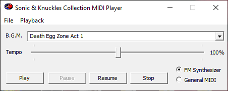

# skc-tools

Tools for use with Sonic &amp; Knuckles Collection (1997). Includes the following tools:
- ``skc-midi-player`` is a GUI application that allows playing and converting the in-game music, utilizing the original ``MIDIOUT.DLL`` for playback.
- ``skc2smf`` is a cross-platform command line tool for converting from the game's internal "CMP" resources to the Standard MIDI Format.

More detailed information about the formats and APIs used can be found [here](https://info.sonicretro.org/Sonic_%26_Knuckles_Collection/Technical_information/Music_and_sound_effects). Parts of this program are based on [skc-mod-loader](https://github.com/sonicretro/skc-mod-loader) and [SKC-Midi](https://info.sonicretro.org/SKC-Midi).
